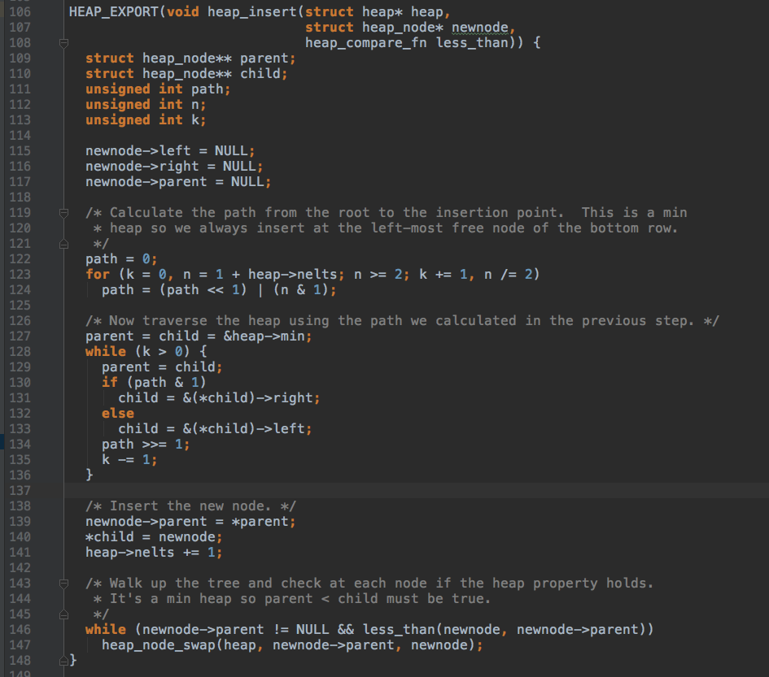
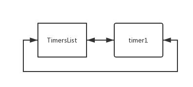
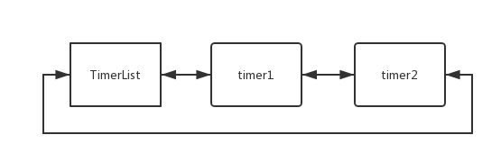
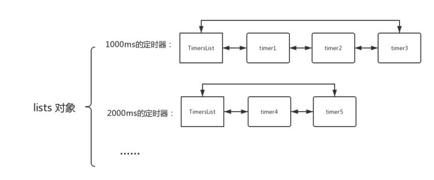
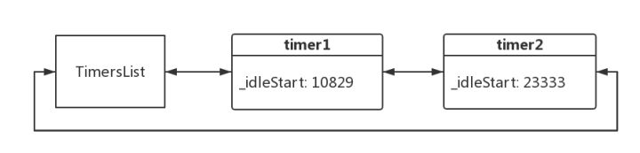
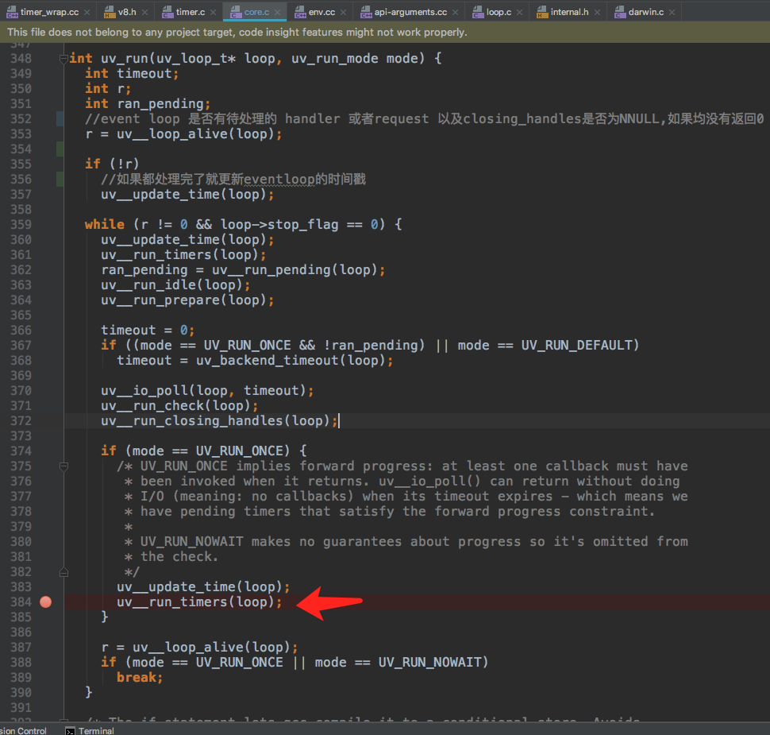
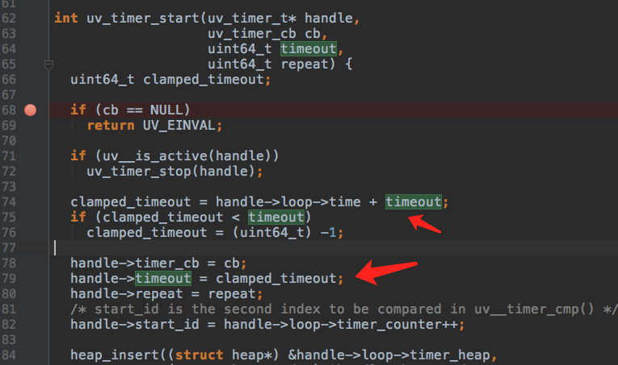
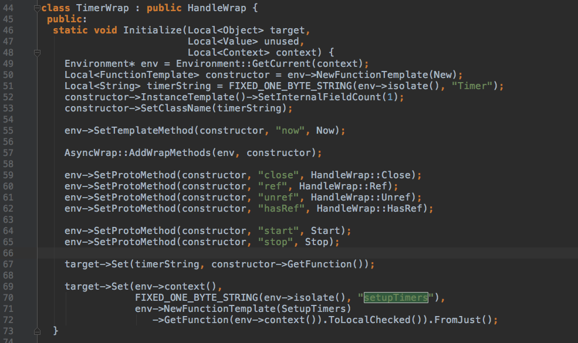

# timer模块学习

## 前言

<blockquote>node timer 是node中一个非常重要的模块， 几乎所有的server相关的服务都离不开timer模块。

在node.js 基础库中，任何一个TCP I/O模块都会产生一个timer（定时器）对象，以便记录请求/响应是否

超时。 比如发起了一个http请求，请求头上有个connection：keep-alive ，让服务器维持TCP连接，但是

这个连接不可能一直维持，所以会给它设置一个超时时间，一旦超时就会断开连接，这个超时断开操作正

是通过Timers实现的，即使没有keep-alive，每次请求的时候 也会设置一个超时时间，避免数据迟迟不返回

占用server端连接。

所以可以肯定的说，只要你使用node编写web服务，一定会用到timer</blockquote>


### 定时器的实现

Node 中的`setTimeout` `setInternal` `setImmediate` API 都在 lib/timers.js中实现

下面我们以setTimeout为例阅读一下timer的实现源码

#### setTimeout定义

```js 

function setTimeout(callback, after, arg1, arg2, arg3) {
  if (typeof callback !== 'function') {
    throw new ERR_INVALID_CALLBACK();
  }

  var i, args;
  switch (arguments.length) {
    // fast cases
    case 1:
    case 2:
      break;
    case 3:
      args = [arg1];
      break;
    case 4:
      args = [arg1, arg2];
      break;
    default:
      args = [arg1, arg2, arg3];
      for (i = 5; i < arguments.length; i++) {
        // extend array dynamically, makes .apply run much faster in v6.0.0
        args[i - 2] = arguments[i];
      }
      break;
  }

  const timeout = new Timeout(callback, after, args, false, false);
  active(timeout);

  return timeout;
}
```

可以看到setTimeout 接收5个参数，根据平常的setTimeout使用习惯，我们知道after是我们传入的定时时间，

参数的处理我们暂时先按下不表，继续往下看，<font color=FA8072>new Timeout</font>跟<span style="color:red">active(timeout)</span>分别做了什么？

#### Timeout构造函数

```js 
// Timer constructor function.
// The entire prototype is defined in lib/timers.js
function Timeout(callback, after, args, isRepeat, isUnrefed) {
  after *= 1; // coalesce to number or NaN
  if (!(after >= 1 && after <= TIMEOUT_MAX)) {
    if (after > TIMEOUT_MAX) {
      process.emitWarning(`${after} does not fit into` +
                          ' a 32-bit signed integer.' +
                          '\nTimeout duration was set to 1.',
                          'TimeoutOverflowWarning');
    }
    after = 1; // schedule on next tick, follows browser behavior
  }

  this._called = false;
  this._idleTimeout = after;
  this._idlePrev = this;
  this._idleNext = this;
  this._idleStart = null;
  // this must be set to null first to avoid function tracking
  // on the hidden class, revisit in V8 versions after 6.2
  this._onTimeout = null;
  this._onTimeout = callback;
  this._timerArgs = args;
  this._repeat = isRepeat ? after : null;
  this._destroyed = false;

  this[unrefedSymbol] = isUnrefed;

  initAsyncResource(this, 'Timeout');
}
```

这个Timeout 生成的timer实例 表示Node.js层面的定时器对象，比如 setTimeout、setInterval返回的对象

 ```  var timer = setTimeout(() => {}, 1000);  ```

(剧透一下： 还有一个由底层C++ time_wrap 模块提供的runtime层面的定时器对象：

``` const Timer = process.binding('timer_wrap').Timer;) ```

Timeout构造函数的整个原型链是在lib/timers.js 中定义的,如下述代码所示


```js 
Timeout.prototype.unref = function() {
  if (this._handle) {
    this._handle.unref();
  } else if (typeof this._onTimeout === 'function') {
    const now = TimerWrap.now();
    if (!this._idleStart) this._idleStart = now;
    var delay = this._idleStart + this._idleTimeout - now;
    if (delay < 0) delay = 0;

    // Prevent running cb again when unref() is called during the same cb
    if (this._called && !this._repeat) {
      unenroll(this);
      return;
    }

    const handle = reuse(this);
    if (handle !== null) {
      handle._list = undefined;
    }

    this._handle = handle || new TimerWrap();
    this._handle.owner = this;
    this._handle.start(delay);
    this._handle.unref();
  }
  return this;
};

Timeout.prototype.ref = function() {
  if (this._handle)
    this._handle.ref();
  return this;
};

Timeout.prototype.close = function() {
  this._onTimeout = null;
  if (this._handle) {
    if (destroyHooksExist() &&
        typeof this[async_id_symbol] === 'number' &&
        !this._destroyed) {
      emitDestroy(this[async_id_symbol]);
      this._destroyed = true;
    }

    this._idleTimeout = -1;
    this._handle.close();
  } else {
    unenroll(this);
  }
  return this;
};
```

注意到 Timeout的原型链上有unref 跟ref 两个方法，他们分别对应的是对refedLists 跟unrefedLists的处理，

（剧透一下，timer有精妙的数据结构设计，维持了两个链表，refedLists 是给Node.js外部的定时器(即第三方

代码)使用的，而 unrefedLists 是给内部模块(如 net 、http、http2)使用）

平时的代码编写中我们可能不会在应用层用到它，它主要是给 TimerList生成的时候用的(埋个伏笔，后续讲到)


#### active(timer) 

active 是激活，如何激活一个定时器呢？ 就是把它插入到定时器队列里去，所以active(timer)主要做的是

insert(timer, false)， 我们看一下insert的实现


```js 
// The underlying logic for scheduling or re-scheduling a timer.
//
// Appends a timer onto the end of an existing timers list, or creates a new
// TimerWrap backed list if one does not already exist for the specified timeout
// duration.
function insert(item, unrefed, start) {
  const msecs = item._idleTimeout;
  if (msecs < 0 || msecs === undefined) return;

  if (typeof start === 'number') {
    item._idleStart = start;
  } else {
    item._idleStart = TimerWrap.now();
  }

  const lists = unrefed === true ? unrefedLists : refedLists;

  // Use an existing list if there is one, otherwise we need to make a new one.
  var list = lists[msecs];
  if (list === undefined) {
    debug('no %d list was found in insert, creating a new one', msecs);
    lists[msecs] = list = new TimersList(msecs, unrefed);
  }

  if (!item[async_id_symbol] || item._destroyed) {
    item._destroyed = false;
    initAsyncResource(item, 'Timeout');
  }

  L.append(list, item);
  assert(!L.isEmpty(list)); // list is not empty
}
```

体现node timer编写者智慧的时刻到了！

Node.js 会使用一个双向链表 来保存所有定时相同的timer， 对于同一个链表中的所有timer ，只会创建一个Timer

对象。当链表中前面的timer超时的时候，会出发回调，在回调中重新计算下一次的超时时间，然后重置Timer对象以减少重复Timer对象的创建开销。

看代码174行，在timer实例上挂载了一个item._idleStart = TimerWrap.now(); 属性， 查阅代码我们知道，这个TimerWrap方法 是由底层C++模块 time_wrap 提供的。

```js 
const {
  Timer: TimerWrap,
  setupTimers,
} = process.binding('timer_wrap');
```

timer_wrap 是桥接层 模块用来封装一些底层api 给js调用

```js 
class TimerWrap : public HandleWrap {
 public:
  static void Initialize(Local<Object> target,
                         Local<Value> unused,
                         Local<Context> context) {
    Environment* env = Environment::GetCurrent(context);
    Local<FunctionTemplate> constructor = env->NewFunctionTemplate(New);
    Local<String> timerString = FIXED_ONE_BYTE_STRING(env->isolate(), "Timer");
    constructor->InstanceTemplate()->SetInternalFieldCount(1);
    constructor->SetClassName(timerString);

    env->SetTemplateMethod(constructor, "now", Now);

    AsyncWrap::AddWrapMethods(env, constructor);

    env->SetProtoMethod(constructor, "close", HandleWrap::Close);
    env->SetProtoMethod(constructor, "ref", HandleWrap::Ref);
    env->SetProtoMethod(constructor, "unref", HandleWrap::Unref);
    env->SetProtoMethod(constructor, "hasRef", HandleWrap::HasRef);

    env->SetProtoMethod(constructor, "start", Start);
    env->SetProtoMethod(constructor, "stop", Stop);

    target->Set(timerString, constructor->GetFunction());

    target->Set(env->context(),
                FIXED_ONE_BYTE_STRING(env->isolate(), "setupTimers"),
                env->NewFunctionTemplate(SetupTimers)
                   ->GetFunction(env->context()).ToLocalChecked()).FromJust();
  }

  size_t self_size() const override { return sizeof(*this); }
```

​	可以在timer_wrap.cc 中看到TimeWrap是一个类， 上面定义了一些公有静态方法，私有静态方法， 在初始化的时候将定义的方法挂载到 contructor原型上，addon导出start，stop， now方法供js层调用。

​	TimerWrap.now()方法获取当前event循环 时间，赋值给_idleStart（<span style="color: red;">这很重要大家需要留意</span>）

​	继续往下走，会定义根据unrefed 的ture/false 决定使用 unrefedLists/refedLists， 在这里，用的是refedLists。 refedLists是一个空对象，它将存储的 key值是超时时间， value值是存储 具有相同超时timer 的双向列表。它们的key代表这一组定时器的超时时间， key对应的value， 都是一个定时器链表，比如 lists[1000]对应的就是由一个或多个超时时间为1000ms的timer组成的链表。

当你的代码中第一次调用定时器方法时，例如：

let timer1 = setTimeout(() => {}, 1000);

这时候，lists对象中是空的，没有任何链表，Timers就会在对应的位置上(这个例子中是lists[1000]) 创建一个TimersList 作为链表头部，并且把刚才创建的新的timer放入链表中。

参见代码：

```js 
  // Use an existing list if there is one, otherwise we need to make a new one.
  var list = lists[msecs];
  if (list === undefined) {
    debug('no %d list was found in insert, creating a new one', msecs);
    lists[msecs] = list = new TimersList(msecs, unrefed);
  }
```

可以试试把它打印出来：

```var timer1 = setTimeout(() => {}, 1000)```

```timer1._idlePrev   //=> TimersList  {….}```

```timer1._idlePrev._idleNext  //=> timer1```

node 在lib/internal/linklist.js中抽象出链表的 基础操作，每个item都是一个个node层的timer。

我们看看TimersList中做了什么

```js 
function TimersList(msecs, unrefed) {
  this._idleNext = this; // Create the list with the linkedlist properties to
  this._idlePrev = this; // prevent any unnecessary hidden class changes.
  this._unrefed = unrefed;
  this.msecs = msecs;

  const timer = this._timer = new TimerWrap();
  timer._list = this;

  if (unrefed === true)
    timer.unref();
  timer.start(msecs);
}
```

初始化链表， 实例化底层timer， 如上所述，TimerWrap是桥接层，导出了start方法给js 层调用， 如代码所示， 实例化操作完成后，执行了```timer.start(msecs)``` 方法


```c++ 
TimerWrap(Environment* env, Local<Object> object)
      : HandleWrap(env,
                   object,
                   reinterpret_cast<uv_handle_t*>(&handle_),
                   AsyncWrap::PROVIDER_TIMERWRAP) {
    int r = uv_timer_init(env->event_loop(), &handle_);
    CHECK_EQ(r, 0);
  }

  static void Start(const FunctionCallbackInfo<Value>& args) {
    TimerWrap* wrap = Unwrap<TimerWrap>(args.Holder());

    CHECK(HandleWrap::IsAlive(wrap));

    int64_t timeout = args[0]->IntegerValue();
    int err = uv_timer_start(&wrap->handle_, OnTimeout, timeout, 0);
    args.GetReturnValue().Set(err);
  }
```

首先TimerWrap 会执行uv_timer_init方法， 

```c++ 
int uv_timer_init(uv_loop_t* loop, uv_timer_t* handle) {
  uv__handle_init(loop, (uv_handle_t*)handle, UV_TIMER);
  handle->timer_cb = NULL;
  handle->repeat = 0;
  return 0;
}
```


参数有两个： 第一个是 主event_loop， 第二个参数为指向uv_timer_t 的指针， 主要是为了初始化handle

- handle-> flags 标示此timer是否已经结束
- handle-> type 标示此timer的类型，在deps/uv/doc/handle.rst 中有枚举定义
- handle-> repeat 是否重复执行
- handle->  timer_cb 超时后需要执行的回调
- handle->timeout 定时执行的时间 

接下来会执行 uv_timer_start方法，

 ```c++ 
int uv_timer_start(uv_timer_t* handle,
                   uv_timer_cb cb,
                   uint64_t timeout,
                   uint64_t repeat) {
  uint64_t clamped_timeout;

  if (cb == NULL)
    return UV_EINVAL;

  if (uv__is_active(handle))
    uv_timer_stop(handle);

  clamped_timeout = handle->loop->time + timeout;
  if (clamped_timeout < timeout)
    clamped_timeout = (uint64_t) -1;

  handle->timer_cb = cb;
  handle->timeout = clamped_timeout;
  handle->repeat = repeat;
  /* start_id is the second index to be compared in uv__timer_cmp() */
  handle->start_id = handle->loop->timer_counter++;

  heap_insert((struct heap*) &handle->loop->timer_heap,
              (struct heap_node*) &handle->heap_node,
              timer_less_than);
  uv__handle_start(handle);

  return 0;
}
 ```

从上述代码中可以看到，uv_timer_start 接收四个参数uv_timer_t handle, 回调函数，超时时间， 是否重复。根据传过来的参数对handle进行属性设置

start_id是由timer_counter自增得到，用来在uv__timer_cmp()中作为第二个比较指标，即 先加入的定时器一定先超时

将timer节点插入到最小堆中， 最小堆在 heap-inl.h头文件中实现

最小堆结构体定义：


```C++ 
/* A binary min heap.  The usual properties hold: the root is the lowest
 * element in the set, the height of the tree is at most log2(nodes) and
 * it's always a complete binary tree.
 *
 * The heap function try hard to detect corrupted tree nodes at the cost
 * of a minor reduction in performance.  Compile with -DNDEBUG to disable.
 */
struct heap {
  struct heap_node* min;
  unsigned int nelts;
};
```

最小堆的根节点一定是最小的元素，最小堆的高度 最多是 log2(nodes)，它经常是一个完全二叉树， 最小堆的插入节点的时间复杂度是O(lgn)，主要是为了优化频繁的timer插入性能

- heap_node* min 是初始化的最小节点


- nelts 表示 最小堆中节点的个数。

最小堆节点的结构体定义：

```C++ 
struct heap_node {
  struct heap_node* left;
  struct heap_node* right;
  struct heap_node* parent;
};
```

下面看一下timer节点是怎样插入到最小堆中的




heap_insert有三个参数， 最小堆， 新节点， 节点比较函数

- 首先是定义父子节点指针，初始化新节点的 left，right，parent节点，
- 第123-124行根据nelts 堆节点的个数，算出最小堆的高度K，以及最小根节点到最大叶子节点的路径path
- 139-140行表示找到最后一个node节点，插入到它后面
- 146-147 行表示 如果node新节点比node的parent节点小，就交换它俩， 直到 新节点比parent节点大， 插入操作结束。

以上是最小堆的插入操作。

继续往下走，到了 uv__handle_start(handle) ，

```c++ 
#define uv__handle_start(h)                                                   \
  do {                                                                        \
    assert(((h)->flags & UV__HANDLE_CLOSING) == 0);                           \
    if (((h)->flags & UV__HANDLE_ACTIVE) != 0) break;                         \
    (h)->flags |= UV__HANDLE_ACTIVE;                                          \
    if (((h)->flags & UV__HANDLE_REF) != 0) uv__active_handle_add(h);         \
  }                                                                           \
  while (0)
```

```c++ 
#define uv__active_handle_add(h)                                              \
  do {                                                                        \
    (h)->loop->active_handles++;                                              \
  }                                                                           \
  while (0)
```

执行一次active handle add操作，并将event_loop的active_handles 加1.

到此为止，我们nodejs中定义的一个定时器已经加到 定时器链表里了，并且随着event_loop的执行，将会执行超时定时器的回调函数。

流水账式的记录了这么多，可能大家已经看晕了，下面借用网上<https://zhuanlan.zhihu.com/p/30763470> Starkwang.log 大神的图来描述一下这个定时器链表

一开始链表是这样的：



插入节点后：



定时器的超时时间不同，不停的插入后，将变成这样



大家注意到每个链表的最左侧是个TimersList，正如我们前面说的，TimersList包含了我们所要复用的Timer对象，也就是底层C++实现的那个定时器，它承担了整个链表的计时工作。



如图所示，等到一个超时时间 比如1000ms到了之后会执行timer1， 

1. 承担计时任务的TimerList对象中的Timer （也就是C++实现的）触发回调，执行timer1 所绑定的回调函数
2. 把timer1 从链表中移除
3. 重新计算多久后出发下一次回调(即timer2 对应的回调)，重置Timer，重复1过程。

那么刚才我们所描述的定时器 行为 又是怎么实现 的呢？ 前面我们阅读了 timer加入链表的实现，那么定时器如何被调度的呢？带着这些问题我们继续往下阅读源码。




如上图代码所示，在event loop中，执行uv__update_time(loop)更新时间后 立即调用 uv__run_timers(loop),  可见timer的优先级相当高，

uv__run_timers()是在 timer.c中定义，我们继续看看 timer.c 做了些什么？

(ps. 大家可能疑惑怎么突然扯到 uv_run() 了，它是从哪出发执行的呢？ 它其实是在node.cc start() 函数里启动的，即node一开始运行就启动它了)


```c++ 
void uv__run_timers(uv_loop_t* loop) {
  struct heap_node* heap_node;
  uv_timer_t* handle;

  for (;;) {
    heap_node = heap_min((struct heap*) &loop->timer_heap);
    if (heap_node == NULL)
      break;

    handle = container_of(heap_node, uv_timer_t, heap_node);
    if (handle->timeout > loop->time)
      break;

    uv_timer_stop(handle);
    uv_timer_again(handle);
    handle->timer_cb(handle);
  }
}
```

在uv__run_timers, 通过 heap_min取出最小的timer节点， 如果为空则跳出循环，

```c++ 
#define container_of(ptr, type, member) \
  ((type *) ((char *) (ptr) - offsetof(type, member)))
```

调用container_of 通过heap_node的偏移取出对象的首地址， 如果最小timer 的timeout时间 大于当前event loop 的时间则说明过期时间还没到，则退出循环。 如果到了时间了， 则先通过uv_timer_stop(handle) 将handle从堆中删除，如果发现是重复的定时器，就通过uv_timer_again(handle) 再重复加入到堆中，执行handle->timer_cb(handle) 的回调后继续循环。


#### 还记得uv_timer_start()函数中的 74-79行么？



​	```handle->timeout = clamped_timeout ``` 

​	```clamped_timeout = handle->loop->time + timeout(定时器超时时间)```

所以当event loop的时间更新后只需要去检查是否 有timer到期 要执行即可。

最小堆插入的时候也是 到期时间越短的越在前面。

结语：

至此我们基本上已经看完了 timer 实现的整个流程，整个timer模块闪烁着开发者的智慧精髓

- 数据结构抽象


- - linkedlist.js 抽象出链表的基础操作。


- 以空间换时间


- - 相同超时时间的定时器分组，而不是使用一个unrefTimer，复杂度降到 O(1)。


- 对象复用


- - 相同超时时间的定时器共享一个底层的 C的 timer。


- 80/20法则


- - 优化主要路径的性能。

#### listOnTimeout 




timer_wrapper 中在Initialize 的时候会setupTimers， 设置定时器，每个event loop 周期都会去检查处理定时器，主要处理操作是在 listOnTimeout中


在代码223行， 会使用L.peek方法依次取出链表中的节点，每取出一个 定时器节点，就检查当前event loop的时间，跟定时器的启动时间差值(第224行)  

如果差值小于定时器超时时间则继续执行 uv_timer_start，并返回跳出循环；

如果差值大于等于定时器超时时间，则执行L.remove(timer)，将定时器从链表中移除，执行tryOnTimeout方法

```c++ 
// An optimization so that the try/finally only de-optimizes (since at least v8
// 4.7) what is in this smaller function.
function tryOnTimeout(timer, start) {
  timer._called = true;
  const timerAsyncId = (typeof timer[async_id_symbol] === 'number') ?
    timer[async_id_symbol] : null;
  var threw = true;
  if (timerAsyncId !== null)
    emitBefore(timerAsyncId, timer[trigger_async_id_symbol]);
  try {
    ontimeout(timer, start);
    threw = false;
  } finally {
    if (timerAsyncId !== null) {
      if (!threw)
        emitAfter(timerAsyncId);
      if (!timer._repeat && destroyHooksExist() &&
          !timer._destroyed) {
        emitDestroy(timerAsyncId);
        timer._destroyed = true;
      }
    }
  }
}

function ontimeout(timer, start) {
  const args = timer._timerArgs;
  if (typeof timer._onTimeout !== 'function')
    return promiseResolve(timer._onTimeout, args[0]);
  if (start === undefined && timer._repeat)
    start = TimerWrap.now();
  if (!args)
    timer._onTimeout();
  else
    Reflect.apply(timer._onTimeout, timer, args);
  if (timer._repeat)
    rearm(timer, start);
}
```

在ontimeout里执行 timer._onTimeout()函数， 即定时器的回调函数。

至此定时器timer的添加到执行的代码都已经阅读完， 整个timers的流程分析到此结束。该文是本菜研究学习timer源码的心路历程，贴出来跟大家分享，希望能帮到后续学习timer模块的同学，同时也欢迎大家指正。


